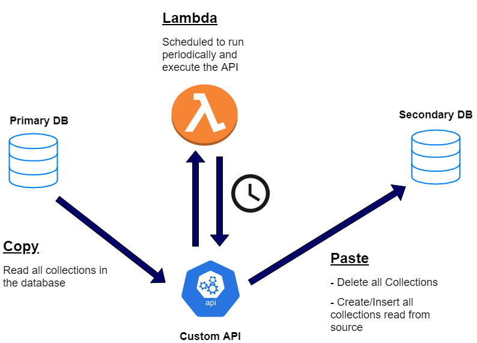
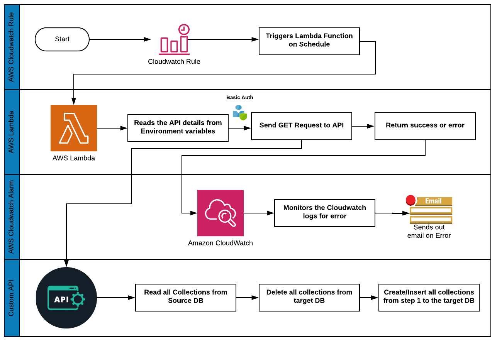
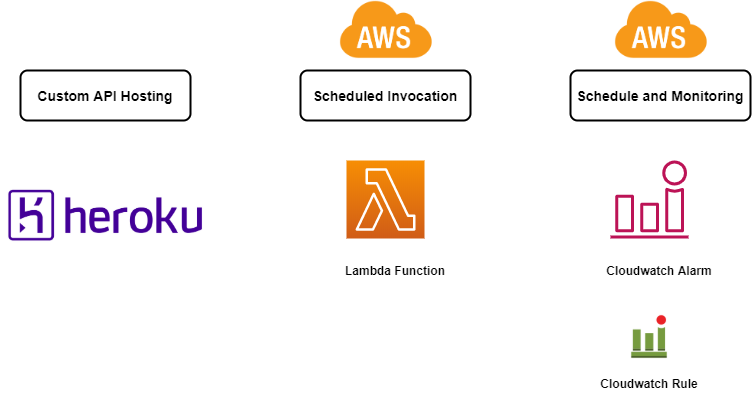
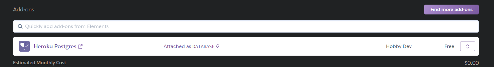
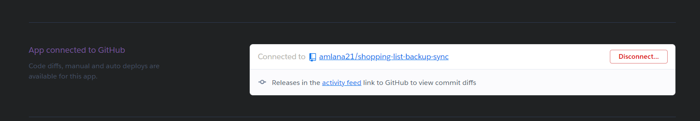
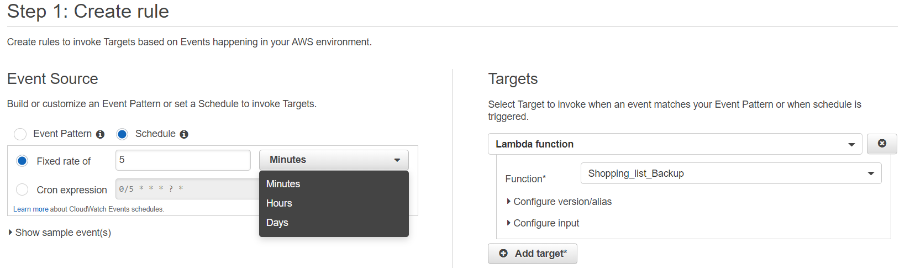
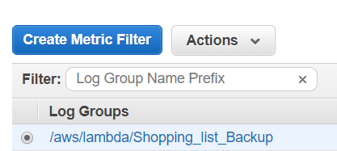
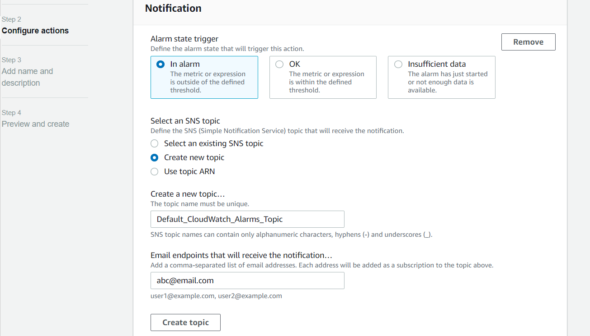

# A MongoDB backup solution using Flask and AWS Lambda  

In this post I will be going through a very simple backup solution to backup MongoDB database to a separate backup database.This is a solution which I developed and use in some of my personal projects.Many times for our personal projects, we struggle to keep some redundancy for the underlying data.Since we have a limited or no budget for the personal projects and applications, to keep the databases backed up, the solution will also have to be cost effective.  

Overall this solution consist of a custom API which will expose endpoints to perform the database backup.The API call will be scheduled as a repititive job using AWS lambda and Cloudwatch.AWS provides a free tier option within which the lambda limits are more than enough to handle the periodic run.We can use Heroku to host the cucstom API.This combination will provide a totally cost free option for you to host the end to end solution.  

A basic version of the custom API can be found in my below Github repo. I am still enhancing the code to add more features to it but the overall process remains same. To follow through the process, some basic AWS knowledge and understanding will be needed.  

https://github.com/amlana21/db-backup-sync-publish


## What is MongoDB  
MongoDB is one of the popular NoSQL database option available. It is a database which is document based and stores data in JSON-like structures.There is no specific schema to be defined for the tables.Since its a NoSQL DB, it doesnt use the traditional row-column structure which we usually see in the relational databases. To understand this concept, we can compare a row from a relational database to a Document in MongoDB and a table to a Collection in MongoDB.There has been an increasing usage of NoSQL databases because of their easy scalability.  
I use MongoDB in many of my personal projects because of the lightweight nature and availability of free options. To know more about MongoDB, you can go to the offcial documentation website.  

## Why the Solution?  
I know there are a lot of DB backup options available out there which are more production ready and more optimized.But I wanted a backup solution which is both cost effective and I have full control on.Since normally for such personal projects we have to manage on our own,a solution to make the applications Highly available,should be cost effective or nearly no-cost. So I developed my own backup process and solution which I can customize and control.  
I use this process to backup the DB to a secondary database to keep that in sync.Any issue on the primary DB, I can switch over to the secondary DB with just an endppoint change.  

## Solution Details  
Lets get into the details of my backup process.Below is a high level architecture of the end to end process.  

  

We will have a primary DB which will be the main DB which your application is connected to.The secondary DB is the backup which will be kept in sync using this backup process.If there are any failures on the primary DB we can just swap the DB url to the secondary DB and the application will be up and running on the secondary DB.Since it is kept in sync with the primary DB, the URL change will be seamless.  

The backup process consist of 4 components which work together.This flow will explain the tasks performed by the each component. 

 

- <em>Custom API: </em>This is an API developed with Flask and Python.The API exposes an endpoint to invoke the method which will perform the backup task.When we invoke the API, it copies all the collections from the source database and copies them to the target DB which is the backup database.    
The API exposes one endpoint which can be invoked by sending a GET request to <url>http://<domain_name>/syncdb</url>. Once you invoke the endpoint, it performs the below steps to backup the primary DB to a secondary DB.The DB details are provided as environment variables in the Flask app.  
1. Dynamically read all the collections from the source DB  
2. Deletes all collections in the Destination DB. If no collections are found, it doesnt do anything in this step  
3. Creates all the collections read in step 1 in the target DB  

For authentication, I have implemented a basic authentication for the API, using username and password.Still working on enhancing the security as using basic username and password is not exactly the best auth method.The user management methods havent been exposed as endpoints. To create users for the API access, the functions can be found in userfuncs.py.  

- <em>Lambda Function to Schedule the Job: </em>We need to automate the API invocation so the backup can run periodically to keep the secondary DB in sync with the primary DB. An AWS lambda function can be used to call the API endpoint periodically on a schedule.Based on the schedule, the Lambda function will be triggered, which will invoke the API endpoint to perform the backup.The lambda function will be pretty straight forward performing these steps:  
1. The API details will be provided as environment variables to the Lambda function  
2. Send a GET request to the API endpoint along with the auth details  
3. The function returns the output from the API. Based on whether the whole process was success or failure, the API will provide a success or error response and Lambda function will return the same as function output  
4. The Lambda function is based on NodeJS runtime  

- <em>CloudWatch rule to Schedule the Lambda execution: </em>To schedule the automated execution of the Lambda function, a Cloudwatch rule is created.The rule will invoke the Lambda function target based on the schedule specified during creation.The execution interval will be be based on how often you need the DBs to sync.This will be determined by how critical the data is.  

- <em>Cloudwatch Alert for monitoring: </em>We will also need to monitor each execution of the Lambda function.A cloudwatch alert is created on the Log group generated for the Lambda function.The alert is based on a metric filter which will look for the error keyword in the Lambda function logs.Whenever there is an error returned from the Custom API, lambda will return the error. The alert will be triggered based on the error and it sends out an email to a specified email address.  

## Setup steps  
Here I will go through the steps to setup different components of the full solution.I will go through a high level description of the steps as getting into detail into each of the components will be too long for one post.Below is a visual for the components we need to setup.  
  

There are few pre-requisites which are needed for the complete setup:  
1. An AWS account  
2. A Heroku account for the custom API  
3. A free MongoDB instance at (https://www.mongodb.com/cloud/atlas)  
4. Python on local machine

- <em>Host the API: </em>The Flask app need to be hosted so the API endpoints are available as https endpoints for the Lambda function.There are multiple options to host the API:  
1. AWS EC2 Instance  
2. AWS Elastic Beanstalk  
3. Docker container on EC2  
4. Heroku(free option)  
I have used Heroku to host the API.The code in Github is ready to be deployed to Heroku. To deploy the API to Heroku, follow the below steps:  
- Create an App on Heroku  
- In the App, go to the Resources tab. Find and add the Heroku Postgres add-on.This will be needed to store the users for the API access.Once the Postgres DB is provisioned, connect to the DB and run the below queries to create the users table.  
```
create table users(
	id SERIAL primary key,
	username varchar not null,
	pssword varchar not null,
	userstatus varchar
)
```  
  

- Clone the Github repo code to your local machine and push to one of your own Github repo  
- Navigate to the Deploy tab of the Heroku app and connect your github repo to this app  
  
- Once connected, you will see options to deploy the code from Github repo to this app.Deploy the app to get the API available on the Heroku app URL. The API URL to trigger the sync API will be https://<heroku_URL>/syncdb  
- Make sure to run the <em>insert_user</em> function from the userfuncs.py script to create users for the API access  

- <em>Create the Lambda Function: </em>Once we have the API hosted, next we need to create the Lambda function to automate the invocation of the sync API.You will need to create a NodeJS lambda function. To create the Lambda function, you will need AWS SAM CLI installed on your machine.Configure SAM CLI to connect to your AWS account and deploy the Lambda function.For details on how to use SAM CLI for the Lambda function, please follow the steps here: https://docs.aws.amazon.com/serverless-application-model/latest/developerguide/serverless-getting-started-hello-world.html  
Make sure the Lambda function is sending logs to a Cloudwatch Log group.Below are high level steps for the Lambda function:  
1. Configure AWS SAM CLI on your local machine  
2. Generate the basic Lambda function using SAM CLI  
3. Based on the functionality described above for the Lambda, write the function code to perform the invocation of the API  
4. Deploy the Lambda function to your AWS account using SAM CLI  

- <em>Cloudwatch Rule to schedule the Lambda invocation:  </em>We will need to create a Cloudwatch rule to run the Lambda function a set schedule.Based on the need the alert will be set on the schedule to invoke the Lambda function target.Follow the below steps to setup the rule:  
1. Navigate to Cloudwatch service page on AWS and click on 'Rules'  
2. Click on Create Rule button and provide the needed details accordingly.Once done complete the creation on next screen  
  

- <em>Cloudwatch Alarm for Monitoring: </em>To monitor the execution of the Lambda function, we will need to setup a Cloudwatch alarm.Follow the below steps to setup the metric filter and the alarm:  
1. Navigate to the 'Log groups' tab on the Cloudwatch service page  
2. Select the proper Log Group for the Lambda function and click on the Metric filter create button:  
 
3. In the next screen, enter the pattern as 'error'. Complete the creation by clicking on 'Assign Metric'  
4. On the next page, click on 'Click Alarm' to open the Alarm creation page  
5. For the Alarm, provide threshold details as needed  
6. For the actions step, select to create a new SNS topic with the email address for the email alert. Email will be triggered to this email address when the Lambda function returns error  
 

Once these steps are completed, the Lambda function should start executing based on the schedule which was specified in the Cloudwatch rule setup.You can verify in the Target Mongo Database to confirm that all collections have been copied from the source DB.  


## Scope of extension  
This is a very crude way of backing up the database. There are options to extend and optimize the code to make the process better.Some of the options I am working on to extend:  
- Better Authentication for the API  
- Change the mode of backup from Delete and replace to a delta only method  
You can work on your own extended features to improve the custom API code.  

## Conclusion  
Hope the backup process I developed helps some of you to setup your own backup tasks.This process may not help in large production applications but it will definitely help in some of your personal projects where you want some level of High availibility for the application.Go ahead and try it. For any questions please reach me at amlanc@achakladar.com.